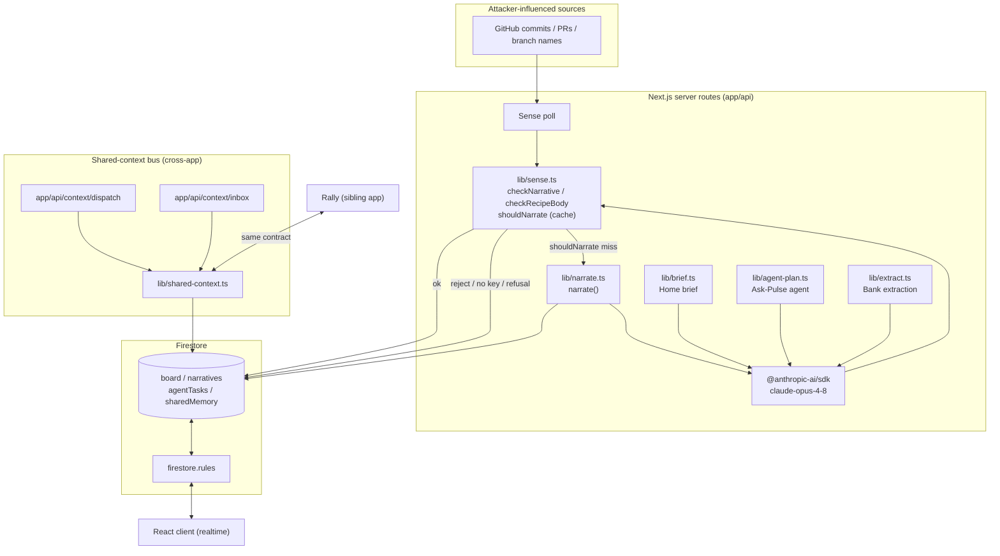
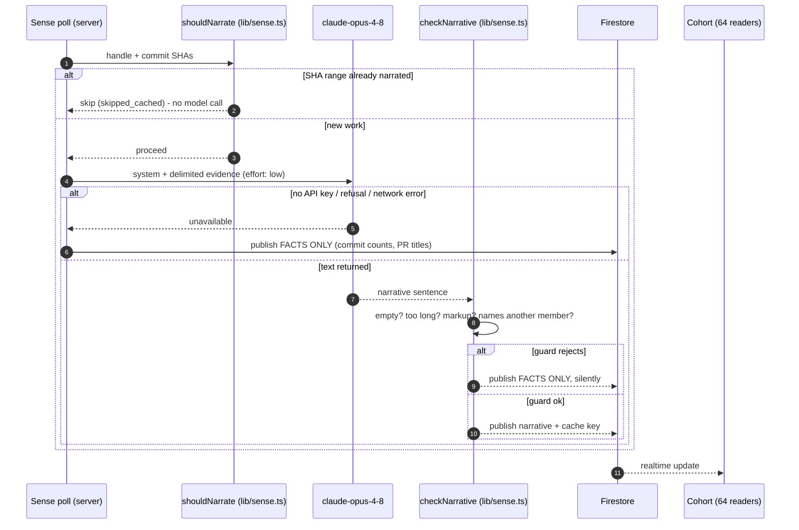

# Pulse, Architecture

Grounded in the actual code paths under `lib/`, `app/api/`, and `firestore.rules`. File references are to this repo.

## Stack

- **Next.js 16 / React 19 / TypeScript:** app router, server routes under `app/api/*`.
- **Firestore (realtime):** client SDK in the browser for live reads; `firebase-admin` server-side for privileged writes. Security enforced by `firestore.rules` (~21 KB of rules, tested).
- **Server-side AI:** `@anthropic-ai/sdk`, model `claude-opus-4-8` (env `ANTHROPIC_MODEL`), called only from server routes. The API key never reaches the client.
- **Vercel:** hosting and cron/poll trigger. Live at pulsecohort.vercel.app.

## Component overview

Key point: **every model output crosses the `checkNarrative` / `checkRecipeBody` guard before it can be published**, and the cache guard (`shouldNarrate`) runs *before* the model is ever called, so the common path costs nothing.

## Sense → narrate → publish (the auto-publish path)

This is the critical sequence: attacker-controlled text (commit messages, PR titles, branch names) is read, fed to a model, and auto-published to 64 people with no human in the loop. The guard is the backstop.

The `names_another_member` rule is the load-bearing one: injection's payoff is publishing a sentence about *someone else*. An actor's commits may only ever produce a sentence about that actor. The guard folds Unicode (NFKD, strips combining marks and zero-width/bidi controls) before a whole-word mention scan, closing the cheapest evasions. Documented residual: cross-script homoglyphs are not folded (`foldForMention` comment, `lib/sense.ts`).

## Cross-app agent-to-agent dispatch (Pulse ↔ Rally)

A real, working mechanism, not a mock:

- **Shared contract:** `lib/shared-context-contract.ts` defines the paths (`sharedMemory/{handle}`, `sharedActivity/{handle}`, `agentTasks`), handle normalization, and the legal task lifecycle (`pending → claimed → done|failed`, `canTransition`).
- **Adapter:** `lib/shared-context.ts` implements `dispatchTask`, `claimTasks`, `completeTask`, `rememberShared`, `logSharedActivity`. Claiming and completion run inside `db.runTransaction` so a task can be claimed once and only follows legal transitions. `APP = 'pulse'` is the only per-app difference from Rally's identical adapter.
- **Live routes:** `app/api/context/dispatch/route.ts` (one app's agent asks another's), `app/api/context/inbox/route.ts` (claim + complete), `app/api/ask-pulse/route.ts` (reads/writes shared memory).
- **Drift guard:** `scripts/audit/contract-drift.mjs` runs *both* apps' behavioral golden tests (`tests/unit/contract-golden.test.ts`) and fails if either contract drifts. Behavioral, not textual, so formatting differences do not false-positive.
- **Cross-app tests:** `tests/integration/shared-context.test.ts` and `tests/integration/cross-app-regression.test.ts` exercise the lifecycle against a real Firestore emulator.

Maturity: **working mechanism, test-proven, wired to live API routes.** Full cross-app operation requires the sibling Rally checkout (`../nikjain15-project-2`); the drift script skips-with-warning if it is absent. Framed honestly on the site as "a working demonstration."

## Data model & security

- Writes that matter (narratives, agent tasks, shared memory) are **server-only** via `firebase-admin`; the client SDK is realtime-read plus tightly-scoped writes.
- `firestore.rules` is the real access-control surface and is tested two ways: `tests/rules/firestore.test.ts` (allow/deny) and `tests/rules/gen-attacks.test.ts` (generated attack matrix).
- The reader's own brief is cached under the reader's uid so rules permit only them to write it (`lib/use-brief.ts`).

## Failure modes designed for

| Failure | Behavior | Where |
|---|---|---|
| No API key | Publish facts only | `narrate()` `no_api_key` |
| Model refusal (safety) | Publish facts only | checks `stop_reason === 'refusal'` |
| Rate limit / network | Publish facts only | try/catch → `model_unavailable` |
| Prompt injection naming a peer | Reject, publish facts only, silently | `checkNarrative` `names_another_member` |
| Model emits markup/HTML | Reject (belt-and-braces with React escaping) | `checkNarrative` `contains_markup` |
| Firestore SDK dead but REST alive | Documented sign-up hang, covered in TESTING.md | `TESTING.md` |
| Unchanged work re-polled | No model call (cache hit) | `shouldNarrate` |
