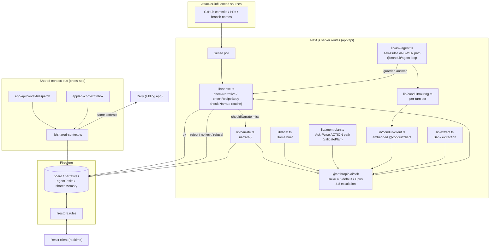
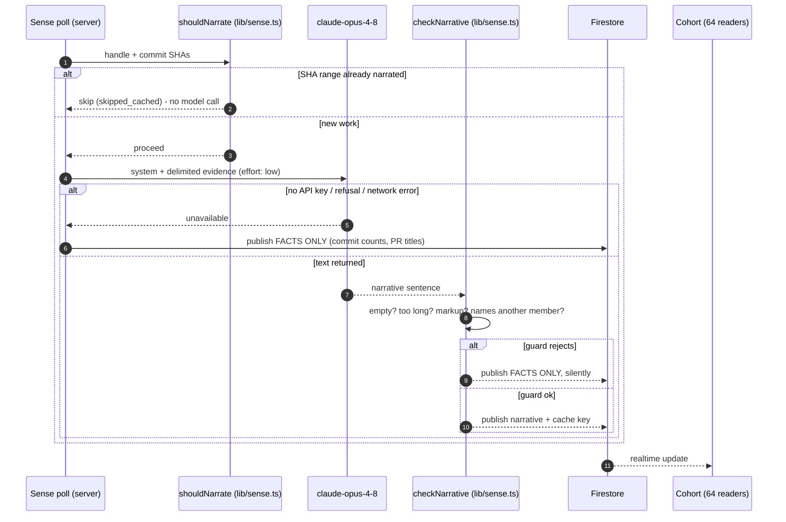

# Pulse, Architecture

Grounded in the actual code paths under `lib/`, `app/api/`, and `firestore.rules`. File references are to this repo.

## Stack

- **Next.js 16 / React 19 / TypeScript:** app router, server routes under `app/api/*`.
- **Firestore (realtime):** client SDK in the browser for live reads; `firebase-admin` server-side for privileged writes. Security enforced by `firestore.rules` (~21 KB of rules, tested).
- **Server-side AI:** `@anthropic-ai/sdk`, called only from server routes. The API key never reaches the client. The auto-publish narration, extraction and brief paths call a single model (`claude-opus-4-8`, env `ANTHROPIC_MODEL`). The generative Ask-Pulse answer path routes through an embedded `@conduit/client` and picks a model per turn (see below). Every live call is wrapped by `lib/retry.ts` (bounded retry, jittered backoff, per-attempt timeout) before it falls back to the facts-only degradation.
- **Vercel:** hosting and cron/poll trigger. Live at pulsecohort.vercel.app.
- **MCP:** a separate, read-only Model Context Protocol server exposes the cohort's public activity to MCP clients. See [MCP.md](MCP.md).

## Component overview

Key point: **every model output crosses the `checkNarrative` / `checkRecipeBody` guard before it can be published**, and the cache guard (`shouldNarrate`) runs *before* the model is ever called, so the common path costs nothing.

## Sense → narrate → publish (the auto-publish path)

This is the critical sequence: attacker-controlled text (commit messages, PR titles, branch names) is read, fed to a model, and auto-published to 64 people with no human in the loop. The guard is the backstop.

The `names_another_member` rule is the load-bearing one: injection's payoff is publishing a sentence about *someone else*. An actor's commits may only ever produce a sentence about that actor. The guard folds Unicode (NFKD, strips combining marks and zero-width/bidi controls) before a whole-word mention scan, closing the cheapest evasions. Documented residual: cross-script homoglyphs are not folded (`foldForMention` comment, `lib/sense.ts`).

## Cross-app agent-to-agent dispatch (Pulse ↔ Rally)

A real, working mechanism, not a mock:

- **Shared contract:** `lib/shared-context-contract.ts` defines the paths (`sharedMemory/{handle}`, `sharedActivity/{handle}`, `agentTasks`), handle normalization, and the legal task lifecycle (`pending → claimed → done|failed`, `canTransition`).
- **Adapter:** `lib/shared-context.ts` implements `dispatchTask`, `claimTasks`, `completeTask`, `rememberShared`, `logSharedActivity`. Claiming and completion run inside `db.runTransaction` so a task can be claimed once and only follows legal transitions. `APP = 'pulse'` is the only per-app difference from Rally's identical adapter.
- **Live routes:** `app/api/context/dispatch/route.ts` (one app's agent asks another's), `app/api/context/inbox/route.ts` (claim + complete), `app/api/ask-pulse/route.ts` (reads/writes shared memory).
- **Drift guard:** `scripts/audit/contract-drift.mjs` runs *both* apps' behavioral golden tests (`tests/unit/contract-golden.test.ts`) and fails if either contract drifts. Behavioral, not textual, so formatting differences do not false-positive.
- **Cross-app tests:** `tests/integration/shared-context.test.ts` and `tests/integration/cross-app-regression.test.ts` exercise the lifecycle against a real Firestore emulator.

Maturity: **working mechanism, test-proven, wired to live API routes.** Full cross-app operation requires the sibling Rally checkout (`../nikjain15-project-2`); the drift script skips-with-warning if it is absent. Framed honestly on the site as "a working demonstration."

## Ask-Pulse: two paths, one guard

Ask-Pulse has two distinct paths, and only one of them is a generative agent:

- **The ACTION path** (create, move, edit a card) still runs through `lib/agent-plan.ts` + `validatePlan` unchanged. Anything with authority is deterministically re-resolved before it can touch the board; that re-resolution is Pulse's injection backstop for side-effecting tools.
- **The generative ANSWER path** (the prose Pulse shows when you ask a question or say hello) is a bounded reason-act loop on the vendored `@conduit/agent` (`lib/ask-agent.ts`, see `conduit/VENDOR.md`). It exposes typed, **read-only** tools over the user's own board (`list_tasks`, `list_projects`, `find_task`, `search_board`, `board_stats`), loads skills at runtime by intent rather than through hard-coded branches, and never sets `allowSideEffects`, so a side-effecting tool would be refused by default. The model call is routed through an embedded `@conduit/client` (`lib/conduit/client.ts`), so every generation flows through Conduit's unified interface and returns a metered record.

Both paths converge on the same backstop: every answer the loop produces passes through the unchanged deterministic `checkNarrative` before it can be shown or dispatched. The agent's output is untrusted model text until it passes exactly the check that gates published narration.

### Per-turn model routing

`lib/conduit/routing.ts` chooses a model per model turn instead of pinning one. The bulk of asks run on a cheap tier (Haiku 4.5, `claude-haiku-4-5`); an ask escalates to the reasoning tier (Opus 4.8, `ANTHROPIC_MODEL`) when it is long or multi-question, when the bounded loop goes multi-step, or when a cheap first pass comes back low-confidence (a hedged or empty answer triggers one reasoning-tier retry). The decision is a pure function of signals available at each turn, so it is deterministic and unit-tested, and it feeds `client.infer({ pinModel })`, so every call stays metered exactly as before. Routing only chooses which model id is targeted; with no API key the path is never reached, and every produced answer still passes `checkNarrative`.

### Live-usage reporting (env-gated)

Each metered call from the answer path can be reported to a central Conduit gateway (`lib/conduit/report-usage.ts`, `POST /v1/decisions`), tagged with the guard outcome. It is env-gated: it is a no-op unless both `CONDUIT_GATEWAY_URL` and `CONDUIT_GATEWAY_TOKEN` are set, and it is fire-and-forget, so it can never delay or change the answer. The default deployment behaves exactly as before.

### Semantic retrieval (present, tested, dormant in production)

`lib/semantic-retrieval.ts` (a cosine vector rerank over the vendored `@conduit/rag`) and the `search_board` tool exist and are unit-tested, but they are **dormant in production**. The embedder is injected, and no embedding provider is wired at the ask-pulse route (`app/api/ask-pulse/route.ts` calls `runAskAgent` without an `embed`). With none configured, `semanticRerank` returns `{ kind: 'disabled' }` and `search_board` degrades to the same case-insensitive substring match the exact-match path uses. So live retrieval is substring matching today; the semantic rerank activates only once a real embedder is injected. It is a strict enhancement, not a live capability, and is not claimed as one.

## The failure ladder for a model call

Every live model call in Pulse (`lib/narrate.ts`, `lib/brief.ts`, `lib/extract.ts`, `lib/agent-plan.ts`, `lib/groundedness.ts`, and the single provider seam in `lib/conduit/client.ts`) goes through the same three rungs, in this order. The bottom rung is the original graceful degradation, unchanged; the two above it were added so a blip stops costing a member their sentence.

1. **Retry, with full jitter.** `withRetry` in `lib/retry.ts` gives a transient failure another attempt: HTTP 408, 409, 425, 429, 500, 502, 503, 504, 529, and network or abort errors that carry no status. Two retries, so three attempts. The wait is exponential backoff with full jitter (a uniform draw over `[0, min(2^n * 250ms, 2000ms))`), because narration fans out across the whole cohort in one sync and fixed backoff would send every member's retry back as a single wave. A `Retry-After` header is honoured when the provider sends one, capped at 2s so a hostile or absurd value cannot park a user-facing request. A **400 or 401 is never retried**: those are facts about the request, and asking again buys the identical rejection twice.
2. **Timeout.** Each attempt gets a hard 6s bound enforced by an `AbortSignal` plus a race, so a call that ignores its signal still cannot hang the request; the abort is what stops it billing tokens in the background. The whole ladder is capped at 9s of wall time, which fits under the 10s Vercel function ceiling that no route in this repo raises. A retry that would not fit the remaining budget is skipped in favour of degrading now, and the last attempt is clamped to whatever budget is left.
3. **Degrade.** When the ladder is exhausted the original provider error is rethrown, so each caller's existing `catch` runs exactly as before and the discriminated-union result is unchanged. The user never sees an error.

What the user sees at each step:

| Step | Narration feed | Home brief | Recipe modal | Ask Pulse |
|---|---|---|---|---|
| Attempt 1 succeeds | The sentence | The written brief | A drafted recipe | The answer |
| Retry succeeds | The sentence, a moment later | The brief, a moment later | The draft, a moment later | The answer, a moment later |
| Ladder exhausted | Facts only: commit counts, PR numbers, files | The warm assembled fallback sentence | An empty modal with a calm note | An empty plan with a plain reason |

Nothing on the bottom row is an error message, a spinner that never ends, or a 500. Every retry decision is reported through `onAttempt`; `logAttempts` writes one server-side line per retry and one when a call only succeeded because of a retry, so an operator can see the provider wobbling before it becomes an outage.

The numbers and their reasoning live in `RETRY_DEFAULTS` in `lib/retry.ts`. The Ask-Pulse answer path deliberately runs a shorter ladder (one retry, 7s budget), because that call sits inside a bounded loop that can take several model turns in a single request.

Tested in `tests/unit/retry.test.ts` (the helper, on an injected clock, sleep and timer, so there are no real timers in the suite) and `tests/unit/narrate.test.ts` (the ladder end to end through a real call path, including that a 400 and a 401 are not retried).

## Data model & security

- Writes that matter (narratives, agent tasks, shared memory) are **server-only** via `firebase-admin`; the client SDK is realtime-read plus tightly-scoped writes.
- `firestore.rules` is the real access-control surface and is tested two ways: `tests/rules/firestore.test.ts` (allow/deny) and `tests/rules/gen-attacks.test.ts` (generated attack matrix).
- The reader's own brief is cached under the reader's uid so rules permit only them to write it (`lib/use-brief.ts`).

## Failure modes designed for

| Failure | Behavior | Where |
|---|---|---|
| No API key | Publish facts only | `narrate()` `no_api_key` |
| Model refusal (safety) | Publish facts only | checks `stop_reason === 'refusal'` |
| Rate limit / network | Retry up to twice with jittered backoff, then publish facts only | `lib/retry.ts` → try/catch → `model_unavailable` |
| Provider hangs | Attempt aborted at 6s, ladder capped at 9s, then publish facts only | `lib/retry.ts` `attemptTimeoutMs` / `totalBudgetMs` |
| Bad request or bad key (400 / 401) | No retry at all, degrade immediately | `lib/retry.ts` `isTransientError` |
| Prompt injection naming a peer | Reject, publish facts only, silently | `checkNarrative` `names_another_member` |
| Model emits markup/HTML | Reject (belt-and-braces with React escaping) | `checkNarrative` `contains_markup` |
| Firestore SDK dead but REST alive | Documented sign-up hang, covered in TESTING.md | `TESTING.md` |
| Unchanged work re-polled | No model call (cache hit) | `shouldNarrate` |
